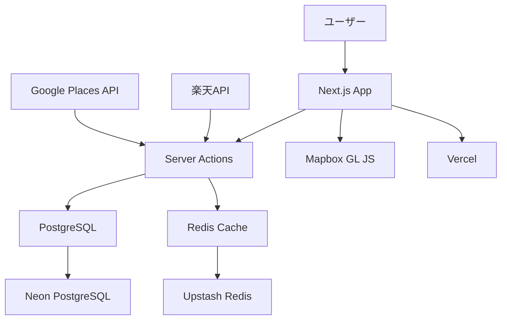
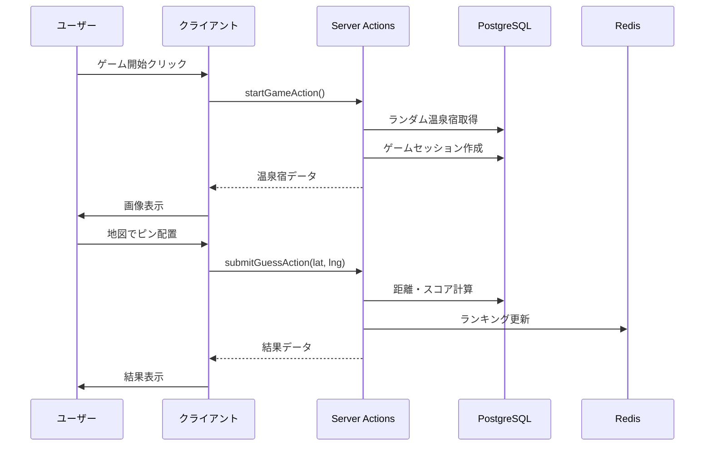

# アーキテクチャ設計

SpaGuessrのシステムアーキテクチャと技術選定の詳細を説明します。

## 📋 目次
- [システム構成](#システム構成)
- [技術選定理由](#技術選定理由)
- [データフロー](#データフロー)
- [パフォーマンス考慮](#パフォーマンス考慮)

## システム構成

### 🏗️ 全体アーキテクチャ



### 🔧 開発環境

| コンポーネント | 技術 | ポート | 説明 |
|---|---|---|---|
| **アプリケーション** | Next.js 14 | 3000 | メインアプリ |
| **データベース** | PostgreSQL 15 | 5432 | データ永続化 |
| **キャッシュ** | Redis 7 | 6379 | セッション・キャッシュ |
| **メール** | Mailhog | 8025 | 開発用SMTP |
| **DB管理** | Drizzle Studio | 4983 | GUI管理画面 |

### 🚀 本番環境

| コンポーネント | サービス | 特徴 |
|---|---|---|
| **ホスティング** | Vercel | Edge Network、自動スケーリング |
| **データベース** | Neon PostgreSQL | サーバーレス、自動バックアップ |
| **キャッシュ** | Upstash Redis | サーバーレス、低レイテンシ |
| **ストレージ** | Vercel Blob | 画像・静的ファイル |

## 技術選定理由

### 🎯 Next.js 14 (App Router)

**採用理由:**
- **フルスタック開発**: フロントエンド・バックエンドの統合
- **Server Actions**: API Routes不要の型安全なサーバー処理
- **パフォーマンス**: 自動最適化、画像最適化
- **SEO対応**: SSR/SSG標準サポート

**メリット:**
```typescript
// Server Actionsで型安全なサーバー処理
export async function startGameAction(): Promise<GameResult> {
  'use server';
  // サーバーサイド処理
}

// クライアントサイドから型安全に呼び出し
const result = await startGameAction();
```

### 🗄️ Server Actions (API Routes不採用)

**採用理由:**
- **型安全性**: クライアント-サーバー間の完全な型安全性
- **自動最適化**: バンドル最適化、ネットワーク効率化
- **楽観的更新**: `useOptimistic`でUX向上
- **開発効率**: API定義・フェッチロジック不要

**従来のAPI Routesとの比較:**
```typescript
// ❌ 従来のAPI Routes
// /api/game/start/route.ts
export async function POST(request: Request) {
  const body = await request.json();
  // 型安全性なし、手動パース必要
}

// フロントエンド
const response = await fetch('/api/game/start', {
  method: 'POST',
  body: JSON.stringify(data)
});
const result = await response.json(); // 型なし

// ✅ Server Actions
// lib/actions/game.ts
export async function startGameAction(data: GameData): Promise<GameResult> {
  'use server';
  // 完全な型安全性
}

// フロントエンド
const result = await startGameAction(data); // 型安全
```

### 🗺️ Mapbox GL JS

**採用理由:**
- **高性能**: WebGL ベースの滑らかな地図レンダリング
- **カスタマイズ性**: 自由なスタイリング・操作感
- **日本対応**: 日本の詳細地図データ
- **GeoGuessr互換**: 同等の操作感を実現可能

**無料枠:**
- 月50,000マップロード
- 開発には十分

### 🏪 状態管理: Zustand + Server Actions

**採用理由:**
- **軽量**: Reduxより軽量でシンプル
- **TypeScript**: 完全な型安全性
- **Server Actions連携**: 非同期処理との相性良好

```typescript
interface GameStore {
  gameId: string | null;
  startGame: () => Promise<void>; // Server Action呼び出し
}

export const useGameStore = create<GameStore>((set) => ({
  gameId: null,
  startGame: async () => {
    const result = await startGameAction();
    set({ gameId: result.gameId });
  }
}));
```

## データフロー

### 🎮 ゲームフロー



### 📊 データキャッシュ戦略

| データ種別 | キャッシュ方式 | 有効期限 | 理由 |
|---|---|---|---|
| **温泉宿一覧** | Redis + Next.js Cache | 1時間 | 更新頻度低い |
| **ランキング** | unstable_cache | 5分 | リアルタイム性重視 |
| **画像** | Vercel CDN | 永続 | 変更されない |
| **地図タイル** | Mapbox CDN | 永続 | 外部サービス |

## パフォーマンス考慮

### ⚡ フロントエンド最適化

```typescript
// 1. コンポーネント分割とlazy loading
const GameMap = lazy(() => import('@/components/map/GameMap'));

// 2. 画像最適化
import Image from 'next/image';
<Image 
  src={spa.image} 
  alt={spa.name}
  width={600}
  height={400}
  priority={true} // 重要な画像
/>

// 3. 地図遅延ロード
useEffect(() => {
  // ユーザーアクション後に地図初期化
  if (gameStarted) {
    initializeMap();
  }
}, [gameStarted]);
```

### 🚀 サーバーサイド最適化

```typescript
// 1. データベースクエリ最適化
export async function getRandomSpa() {
  return await db
    .select({
      id: spasTable.id,
      name: spasTable.name,
      images: spasTable.images,
      latitude: spasTable.latitude,
      longitude: spasTable.longitude
    }) // 必要なフィールドのみ
    .from(spasTable)
    .orderBy(sql`RANDOM()`)
    .limit(1);
}

// 2. キャッシュ活用
export async function getWeeklyRankings() {
  return await unstable_cache(
    async () => {
      // 重い処理
    },
    ['weekly-rankings'],
    { revalidate: 300 } // 5分キャッシュ
  )();
}

// 3. 楽観的更新
export function GameBoard() {
  const [optimisticScore, setOptimisticScore] = useOptimistic(0);
  
  const handleGuess = async (guess) => {
    // 即座にUI更新
    setOptimisticScore(estimateScore(guess));
    
    // サーバー処理は非同期
    const actualResult = await submitGuessAction(guess);
  };
}
```

### 📱 レスポンシブ対応

```css
/* 地図レイアウトの最適化 */
.game-layout {
  /* デスクトップ: 横並び */
  @media (min-width: 1024px) {
    display: grid;
    grid-template-columns: 1fr 1fr;
  }
  
  /* タブレット・スマホ: 縦並び */
  @media (max-width: 1023px) {
    display: flex;
    flex-direction: column;
  }
}

.map-container {
  /* スマホでも操作しやすい最小高さ */
  min-height: 400px;
}
```

## セキュリティ設計

### 🔒 Server Actions セキュリティ

```typescript
// 1. 入力検証
import { z } from 'zod';

const GuessSchema = z.object({
  gameId: z.string().uuid(),
  lat: z.number().min(-90).max(90),
  lng: z.number().min(-180).max(180)
});

export async function submitGuessAction(
  gameId: string,
  lat: number, 
  lng: number
) {
  'use server';
  
  // 入力検証
  const validated = GuessSchema.parse({ gameId, lat, lng });
  
  // 処理...
}

// 2. レート制限
import { ratelimit } from '@/lib/redis';

export async function startGameAction() {
  'use server';
  
  const identifier = await getClientIdentifier();
  const { success } = await ratelimit.limit(identifier);
  
  if (!success) {
    throw new Error('Too many requests');
  }
  
  // 処理...
}
```

---

詳細な実装については各実装ドキュメントを参照してください。 