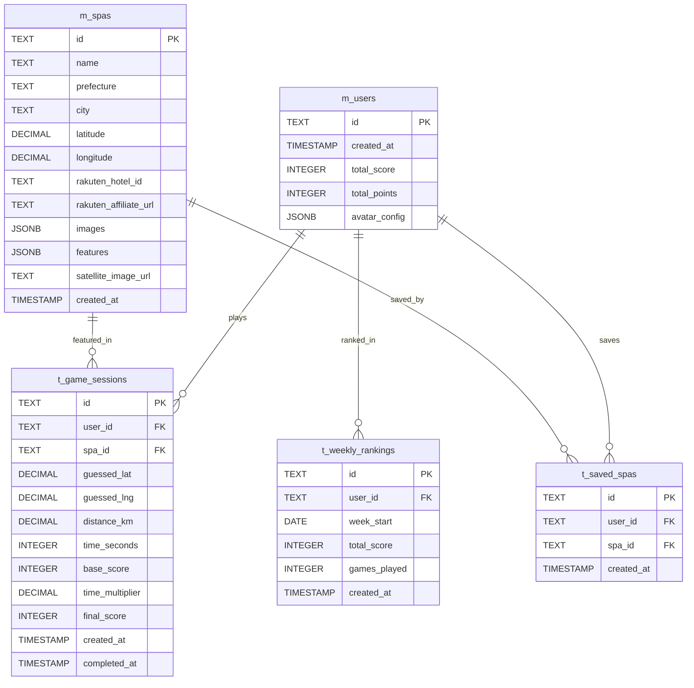

# データベース設計

SpaGuessrのデータベース設計とDrizzle ORMの実装詳細を説明します。

## 📋 目次
- [設計方針](#設計方針)
- [テーブル設計](#テーブル設計)
- [Drizzle ORM設定](#drizzle-orm設定)
- [クエリ実装](#クエリ実装)
- [マイグレーション](#マイグレーション)

## 設計方針

### 🎯 基本原則

```
1. 正規化: 第3正規形まで正規化
2. 型安全性: TypeScriptとの完全な型統合
3. パフォーマンス: 適切なインデックス設計
4. 拡張性: 将来の機能追加を考慮
5. 整合性: 外部キー制約による関連保証
```

### 🗄️ 技術選定

| 項目 | 選択技術 | 理由 |
|---|---|---|
| **ORM** | Drizzle ORM | 型安全性、パフォーマンス、軽量 |
| **開発DB** | PostgreSQL 15 (Docker) | 開発環境の一貫性 |
| **本番DB** | Neon PostgreSQL | サーバーレス、自動スケーリング |
| **マイグレーション** | Drizzle Kit | ORM統合、型安全 |

## テーブル設計

### 📊 ER図



### 🏢 マスタテーブル

#### ユーザーマスタ (m_users)

```typescript
// lib/db/schema.ts
import { pgTable, text, timestamp, integer, jsonb } from 'drizzle-orm/pg-core';

export const usersTable = pgTable('m_users', {
  id: text('id').primaryKey(), // UUID
  createdAt: timestamp('created_at').defaultNow().notNull(),
  totalScore: integer('total_score').default(0).notNull(),
  totalPoints: integer('total_points').default(0).notNull(),
  avatarConfig: jsonb('avatar_config').$type<AvatarConfig>().default({}),
});

// TypeScript型定義
export type User = typeof usersTable.$inferSelect;
export type NewUser = typeof usersTable.$inferInsert;

export interface AvatarConfig {
  hat?: string;
  shirt?: string;
  accessory?: string;
  background?: string;
}
```

#### 温泉宿マスタ (m_spas)

```typescript
export const spasTable = pgTable('m_spas', {
  id: text('id').primaryKey(),
  name: text('name').notNull(),
  prefecture: text('prefecture').notNull(),
  city: text('city').notNull(),
  latitude: decimal('latitude', { precision: 10, scale: 8 }).notNull(),
  longitude: decimal('longitude', { precision: 11, scale: 8 }).notNull(),
  rakutenHotelId: text('rakuten_hotel_id'),
  rakutenAffiliateUrl: text('rakuten_affiliate_url'),
  images: jsonb('images').$type<string[]>().notNull(),
  features: jsonb('features').$type<string[]>().default([]),
  satelliteImageUrl: text('satellite_image_url'),
  createdAt: timestamp('created_at').defaultNow().notNull(),
});

export type Spa = typeof spasTable.$inferSelect;
export type NewSpa = typeof spasTable.$inferInsert;
```

### 📝 トランザクションテーブル

#### ゲームセッション (t_game_sessions)

```typescript
export const gameSessionsTable = pgTable('t_game_sessions', {
  id: text('id').primaryKey(),
  userId: text('user_id').references(() => usersTable.id),
  spaId: text('spa_id').references(() => spasTable.id, { onDelete: 'cascade' }).notNull(),
  guessedLat: decimal('guessed_lat', { precision: 10, scale: 8 }),
  guessedLng: decimal('guessed_lng', { precision: 11, scale: 8 }),
  distanceKm: decimal('distance_km', { precision: 8, scale: 2 }),
  timeSeconds: integer('time_seconds'),
  baseScore: integer('base_score'),
  timeMultiplier: decimal('time_multiplier', { precision: 3, scale: 2 }),
  finalScore: integer('final_score'),
  createdAt: timestamp('created_at').defaultNow().notNull(),
  completedAt: timestamp('completed_at'),
});

export type GameSession = typeof gameSessionsTable.$inferSelect;
export type NewGameSession = typeof gameSessionsTable.$inferInsert;
```

#### 保存宿 (t_saved_spas)

```typescript
export const savedSpasTable = pgTable('t_saved_spas', {
  id: text('id').primaryKey(),
  userId: text('user_id').references(() => usersTable.id, { onDelete: 'cascade' }).notNull(),
  spaId: text('spa_id').references(() => spasTable.id, { onDelete: 'cascade' }).notNull(),
  createdAt: timestamp('created_at').defaultNow().notNull(),
}, (table) => ({
  // 複合ユニーク制約
  userSpaUnique: unique().on(table.userId, table.spaId),
}));

export type SavedSpa = typeof savedSpasTable.$inferSelect;
export type NewSavedSpa = typeof savedSpasTable.$inferInsert;
```

#### 週間ランキング (t_weekly_rankings)

```typescript
export const weeklyRankingsTable = pgTable('t_weekly_rankings', {
  id: text('id').primaryKey(),
  userId: text('user_id').references(() => usersTable.id, { onDelete: 'cascade' }).notNull(),
  weekStart: date('week_start').notNull(), // その週の月曜日
  totalScore: integer('total_score').default(0).notNull(),
  gamesPlayed: integer('games_played').default(0).notNull(),
  createdAt: timestamp('created_at').defaultNow().notNull(),
}, (table) => ({
  // ユーザー・週ごとのユニーク制約
  userWeekUnique: unique().on(table.userId, table.weekStart),
}));

export type WeeklyRanking = typeof weeklyRankingsTable.$inferSelect;
export type NewWeeklyRanking = typeof weeklyRankingsTable.$inferInsert;
```

### 🔍 インデックス設計

```sql
-- パフォーマンス最適化のためのインデックス

-- ゲームセッション関連
CREATE INDEX idx_game_sessions_user_id ON t_game_sessions(user_id);
CREATE INDEX idx_game_sessions_spa_id ON t_game_sessions(spa_id);
CREATE INDEX idx_game_sessions_created_at ON t_game_sessions(created_at);
CREATE INDEX idx_game_sessions_final_score ON t_game_sessions(final_score DESC);

-- 週間ランキング関連
CREATE INDEX idx_weekly_rankings_week_start ON t_weekly_rankings(week_start);
CREATE INDEX idx_weekly_rankings_total_score ON t_weekly_rankings(total_score DESC);

-- 温泉宿検索関連
CREATE INDEX idx_spas_prefecture ON m_spas(prefecture);
CREATE INDEX idx_spas_location ON m_spas(latitude, longitude);

-- 保存宿関連
CREATE INDEX idx_saved_spas_user_id ON t_saved_spas(user_id);
CREATE INDEX idx_saved_spas_created_at ON t_saved_spas(created_at DESC);
```

## Drizzle ORM設定

### ⚙️ 設定ファイル

```typescript
// lib/db/index.ts
import { drizzle } from 'drizzle-orm/postgres-js';
import postgres from 'postgres';
import * as schema from './schema';

// 接続設定
const connectionString = process.env.DATABASE_URL!;

// 開発環境と本番環境での最適化
const client = postgres(connectionString, {
  max: process.env.NODE_ENV === 'production' ? 10 : 1,
  idle_timeout: 20,
  connect_timeout: 30,
});

export const db = drizzle(client, { schema });

// 型エクスポート
export type Database = typeof db;
```

```typescript
// drizzle.config.ts
import type { Config } from 'drizzle-kit';

export default {
  schema: './lib/db/schema.ts',
  out: './lib/db/migrations',
  driver: 'pg',
  dbCredentials: {
    connectionString: process.env.DATABASE_URL!,
  },
  verbose: true,
  strict: true,
} satisfies Config;
```

### 📦 package.json スクリプト

```json
{
  "scripts": {
    "db:generate": "drizzle-kit generate:pg",
    "db:migrate": "drizzle-kit migrate",
    "db:push": "drizzle-kit push:pg",
    "db:studio": "drizzle-kit studio",
    "db:seed": "tsx lib/db/seed.ts",
    "db:reset": "npm run db:drop && npm run db:push && npm run db:seed"
  }
}
```

## クエリ実装

### 🎮 ゲーム関連クエリ

```typescript
// lib/db/queries/game.ts
import { db } from '../index';
import { spasTable, gameSessionsTable } from '../schema';
import { eq, sql, and, desc } from 'drizzle-orm';

// ランダム温泉宿取得
export async function getRandomSpa(): Promise<Spa | null> {
  const result = await db
    .select()
    .from(spasTable)
    .orderBy(sql`RANDOM()`) // PostgreSQL専用
    .limit(1);
  
  return result[0] || null;
}

// ゲームセッション作成
export async function createGameSession(data: {
  id: string;
  spaId: string;
  userId?: string;
}): Promise<void> {
  await db.insert(gameSessionsTable).values({
    ...data,
    createdAt: new Date()
  });
}

// ゲーム結果更新
export async function updateGameResult(
  gameId: string,
  result: {
    guessedLat: number;
    guessedLng: number;
    distanceKm: number;
    timeSeconds: number;
    baseScore: number;
    timeMultiplier: number;
    finalScore: number;
  }
): Promise<void> {
  await db
    .update(gameSessionsTable)
    .set({
      ...result,
      completedAt: new Date()
    })
    .where(eq(gameSessionsTable.id, gameId));
}

// ユーザーのゲーム履歴取得
export async function getUserGameHistory(
  userId: string,
  limit: number = 20
): Promise<Array<GameSession & { spa: Spa }>> {
  return await db
    .select({
      ...gameSessionsTable,
      spa: spasTable
    })
    .from(gameSessionsTable)
    .leftJoin(spasTable, eq(gameSessionsTable.spaId, spasTable.id))
    .where(eq(gameSessionsTable.userId, userId))
    .orderBy(desc(gameSessionsTable.createdAt))
    .limit(limit);
}
```

### 🏆 ランキング関連クエリ

```typescript
// lib/db/queries/rankings.ts
import { weeklyRankingsTable, usersTable } from '../schema';
import { sql } from 'drizzle-orm';

// 週間ランキング取得
export async function getWeeklyRankings(
  weekStart: Date,
  limit: number = 50
): Promise<Array<WeeklyRanking & { user: User; rank: number }>> {
  return await db
    .select({
      ...weeklyRankingsTable,
      user: usersTable,
      rank: sql<number>`ROW_NUMBER() OVER (ORDER BY ${weeklyRankingsTable.totalScore} DESC)`
    })
    .from(weeklyRankingsTable)
    .leftJoin(usersTable, eq(weeklyRankingsTable.userId, usersTable.id))
    .where(eq(weeklyRankingsTable.weekStart, weekStart))
    .orderBy(desc(weeklyRankingsTable.totalScore))
    .limit(limit);
}

// 宿別ランキング取得
export async function getSpaRankings(
  spaId: string,
  limit: number = 20
): Promise<Array<GameSession & { user: User; rank: number }>> {
  return await db
    .select({
      ...gameSessionsTable,
      user: usersTable,
      rank: sql<number>`ROW_NUMBER() OVER (ORDER BY ${gameSessionsTable.finalScore} DESC)`
    })
    .from(gameSessionsTable)
    .leftJoin(usersTable, eq(gameSessionsTable.userId, usersTable.id))
    .where(
      and(
        eq(gameSessionsTable.spaId, spaId),
        isNotNull(gameSessionsTable.finalScore)
      )
    )
    .orderBy(desc(gameSessionsTable.finalScore))
    .limit(limit);
}

// 今週のランキング集計
export async function calculateWeeklyRankings(
  weekStart: Date
): Promise<NewWeeklyRanking[]> {
  const weekEnd = new Date(weekStart);
  weekEnd.setDate(weekEnd.getDate() + 7);

  const stats = await db
    .select({
      userId: gameSessionsTable.userId,
      totalScore: sql<number>`SUM(${gameSessionsTable.finalScore})`,
      gamesPlayed: sql<number>`COUNT(*)`
    })
    .from(gameSessionsTable)
    .where(
      and(
        gte(gameSessionsTable.createdAt, weekStart),
        lt(gameSessionsTable.createdAt, weekEnd),
        isNotNull(gameSessionsTable.finalScore),
        isNotNull(gameSessionsTable.userId)
      )
    )
    .groupBy(gameSessionsTable.userId);

  return stats.map(stat => ({
    id: crypto.randomUUID(),
    userId: stat.userId!,
    weekStart,
    totalScore: stat.totalScore,
    gamesPlayed: stat.gamesPlayed,
    createdAt: new Date()
  }));
}
```

### 👤 ユーザー関連クエリ

```typescript
// lib/db/queries/user.ts

// ユーザー作成・更新
export async function upsertUser(userData: {
  id: string;
  avatarConfig?: AvatarConfig;
}): Promise<User> {
  const result = await db
    .insert(usersTable)
    .values({
      ...userData,
      createdAt: new Date()
    })
    .onConflictDoUpdate({
      target: usersTable.id,
      set: {
        avatarConfig: userData.avatarConfig,
        updatedAt: new Date()
      }
    })
    .returning();

  return result[0];
}

// 保存済み宿一覧取得
export async function getUserSavedSpas(
  userId: string
): Promise<Array<SavedSpa & { spa: Spa }>> {
  return await db
    .select({
      ...savedSpasTable,
      spa: spasTable
    })
    .from(savedSpasTable)
    .leftJoin(spasTable, eq(savedSpasTable.spaId, spasTable.id))
    .where(eq(savedSpasTable.userId, userId))
    .orderBy(desc(savedSpasTable.createdAt));
}

// ユーザー統計情報取得
export async function getUserStats(userId: string): Promise<{
  totalGames: number;
  totalScore: number;
  averageScore: number;
  bestScore: number;
  perfectGuesses: number; // 5km以内
}> {
  const result = await db
    .select({
      totalGames: sql<number>`COUNT(*)`,
      totalScore: sql<number>`SUM(${gameSessionsTable.finalScore})`,
      averageScore: sql<number>`AVG(${gameSessionsTable.finalScore})`,
      bestScore: sql<number>`MAX(${gameSessionsTable.finalScore})`,
      perfectGuesses: sql<number>`COUNT(*) FILTER (WHERE ${gameSessionsTable.distanceKm} <= 5)`
    })
    .from(gameSessionsTable)
    .where(
      and(
        eq(gameSessionsTable.userId, userId),
        isNotNull(gameSessionsTable.finalScore)
      )
    );

  return result[0] || {
    totalGames: 0,
    totalScore: 0,
    averageScore: 0,
    bestScore: 0,
    perfectGuesses: 0
  };
}
```

## マイグレーション

### 🔄 マイグレーション管理

```typescript
// lib/db/migrate.ts
import { migrate } from 'drizzle-orm/postgres-js/migrator';
import { db } from './index';

// マイグレーション実行
export async function runMigrations() {
  try {
    await migrate(db, { migrationsFolder: './lib/db/migrations' });
    console.log('Migrations completed successfully');
  } catch (error) {
    console.error('Migration failed:', error);
    throw error;
  }
}

// 開発用: スキーマリセット
export async function resetDatabase() {
  if (process.env.NODE_ENV === 'production') {
    throw new Error('Cannot reset database in production');
  }

  // テーブル削除（依存関係順）
  await db.execute(sql`DROP TABLE IF EXISTS t_weekly_rankings CASCADE`);
  await db.execute(sql`DROP TABLE IF EXISTS t_saved_spas CASCADE`);
  await db.execute(sql`DROP TABLE IF EXISTS t_game_sessions CASCADE`);
  await db.execute(sql`DROP TABLE IF EXISTS m_spas CASCADE`);
  await db.execute(sql`DROP TABLE IF EXISTS m_users CASCADE`);

  console.log('Database reset completed');
}
```

### 🌱 シードデータ

```typescript
// lib/db/seed.ts
import { db } from './index';
import { spasTable, usersTable } from './schema';

export async function seedDatabase() {
  try {
    // サンプル温泉宿データ
    const sampleSpas: NewSpa[] = [
      {
        id: 'spa-1',
        name: '箱根湯本温泉 天成園',
        prefecture: '神奈川県',
        city: '箱根町',
        latitude: 35.2328,
        longitude: 139.1077,
        images: [
          '/images/spas/spa-1-1.jpg',
          '/images/spas/spa-1-2.jpg',
          '/images/spas/spa-1-3.jpg'
        ],
        features: ['露天風呂', '温泉', '庭園']
      },
      {
        id: 'spa-2',
        name: '草津温泉 ホテル櫻井',
        prefecture: '群馬県',
        city: '草津町',
        latitude: 36.6238,
        longitude: 138.5994,
        images: [
          '/images/spas/spa-2-1.jpg',
          '/images/spas/spa-2-2.jpg'
        ],
        features: ['源泉掛け流し', '露天風呂']
      }
    ];

    await db.insert(spasTable).values(sampleSpas).onConflictDoNothing();

    // サンプルユーザーデータ（開発用）
    if (process.env.NODE_ENV === 'development') {
      const sampleUsers: NewUser[] = [
        {
          id: 'user-1',
          totalScore: 15000,
          totalPoints: 500,
          avatarConfig: { hat: 'cap', shirt: 'blue' }
        }
      ];

      await db.insert(usersTable).values(sampleUsers).onConflictDoNothing();
    }

    console.log('Seed data inserted successfully');
  } catch (error) {
    console.error('Seeding failed:', error);
    throw error;
  }
}

// 実行
if (require.main === module) {
  seedDatabase()
    .then(() => process.exit(0))
    .catch(() => process.exit(1));
}
```

### 🔧 開発用ユーティリティ

```typescript
// lib/db/utils.ts

// 週の開始日（月曜日）を取得
export function getWeekStart(date: Date): Date {
  const result = new Date(date);
  const day = result.getDay();
  const diff = result.getDate() - day + (day === 0 ? -6 : 1); // 月曜日を週の開始とする
  result.setDate(diff);
  result.setHours(0, 0, 0, 0);
  return result;
}

// データベース接続テスト
export async function testConnection(): Promise<boolean> {
  try {
    await db.execute(sql`SELECT 1`);
    console.log('Database connection successful');
    return true;
  } catch (error) {
    console.error('Database connection failed:', error);
    return false;
  }
}

// テーブル存在確認
export async function checkTables(): Promise<string[]> {
  const result = await db.execute(sql`
    SELECT table_name 
    FROM information_schema.tables 
    WHERE table_schema = 'public'
  `);
  
  return result.map(row => row.table_name as string);
}
```

---

このデータベース設計により、型安全で高性能なデータ操作が実現できます。 